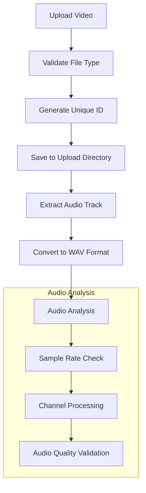
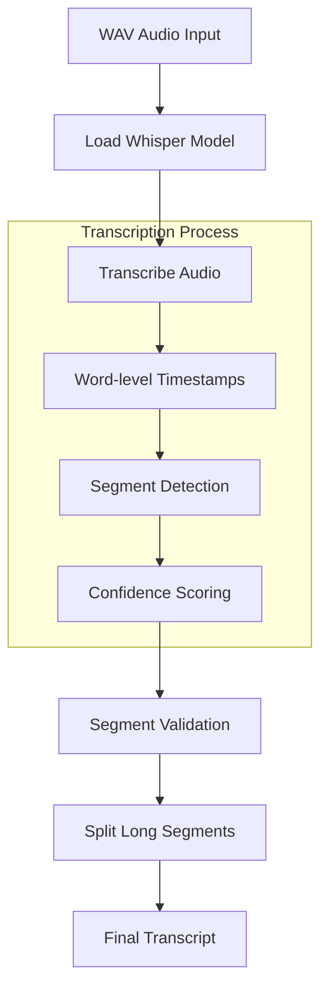
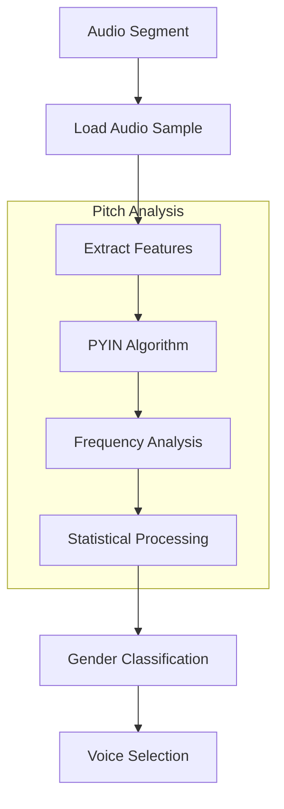
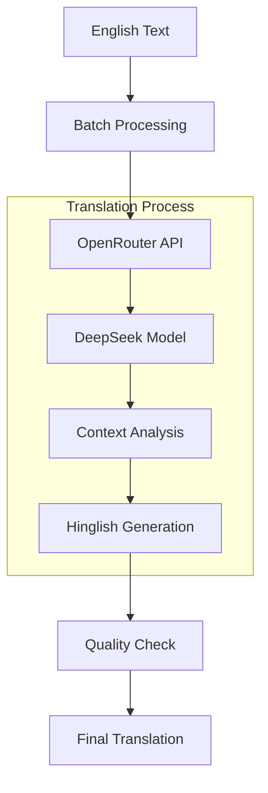
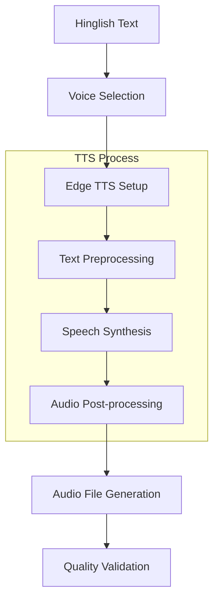
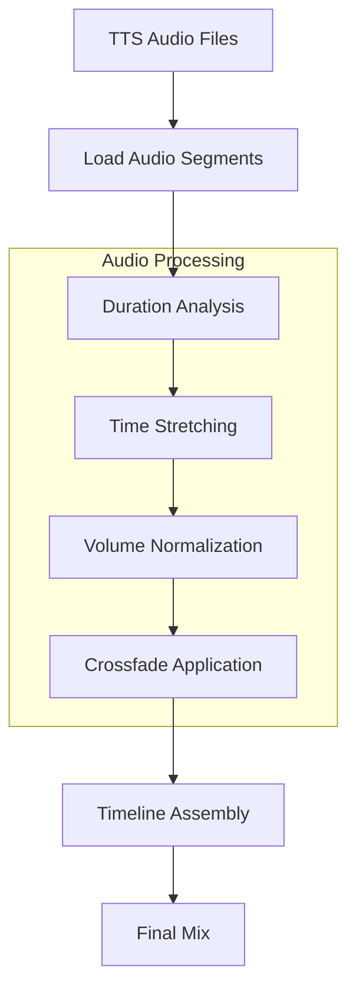
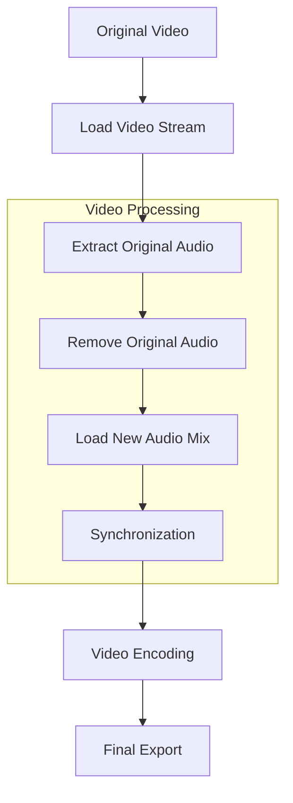

# 🎤 Simple Hinglish Video Dubber

A powerful Flask-based web application that automatically dubs videos into Hinglish (Hindi-English mixed language) using AI-powered speech recognition, translation, and text-to-speech technologies.

## 🔥 Features

- 🎥 Supports multiple video formats (MP4, MOV, MKV, WEBM, M4V, AVI)
- 🗣️ Automatic speech recognition using OpenAI Whisper
- 🔄 Natural English to Hinglish translation using DeepSeek AI
- 🎯 Gender-aware voice selection
- 🔊 High-quality text-to-speech using Microsoft Edge TTS
- 🌐 User-friendly web interface
- ⚡ Optimized audio processing with librosa
- 🎞️ Professional video processing using MoviePy

## 🛠️ System Requirements

- Python 3.8 or higher
- 4GB RAM minimum (8GB recommended)
- 2GB free disk space
- FFMPEG installed

## 📦 Dependencies

```bash
pip install -r requirements.txt
```

Requirements include:
- Flask
- python-dotenv
- numpy
- librosa
- whisper
- edge-tts
- openai
- moviepy
- soundfile
- requests

## 🚀 Quick Start

### ⚡ One-Command Installation (Recommended)

```bash
# Clone the repository
git clone https://github.com/yourusername/hinglish-video-dubber.git
cd hinglish-video-dubber

# Make install script executable
chmod +x install.sh

# Run installation script
./install.sh

# Set up API key
cp .env.example .env
# Edit .env and add your OpenRouter API key

# Start the application
python ok.py
```

### 🛠️ Manual Installation

If you prefer to install components manually:

1. **Clone the repository:**
```bash
git clone https://github.com/yourusername/hinglish-video-dubber.git
cd hinglish-video-dubber
```

2. **Install System Dependencies:**

On Ubuntu/Debian:
```bash
sudo apt update
sudo apt install -y ffmpeg python3 python3-pip python3-venv
```

On macOS:
```bash
brew install ffmpeg python
```

On Windows:
```bash
# Using Chocolatey
choco install ffmpeg python -y

# Or download FFMPEG manually from:
# https://ffmpeg.org/download.html
```

3. **Set up Python Virtual Environment:**
```bash
# Create virtual environment
python3 -m venv venv

# Activate virtual environment
# On Unix/macOS:
source venv/bin/activate
# On Windows:
.\venv\Scripts\activate
```

4. **Install Python Dependencies:**
```bash
pip install --upgrade pip
pip install -r requirements.txt
```

5. **Configure Environment:**
```bash
cp .env.example .env
# Edit .env and add your OpenRouter API key:
# OPENROUTER_API_KEY=your_api_key_here
```

6. **Run the Application:**
```bash
python ok.py
```

### 🔍 Installation Verification

Verify your installation by checking:

1. **FFMPEG Installation:**
```bash
ffmpeg -version
```

2. **Python Version (3.8+ required):**
```bash
python --version
```

3. **Required Libraries:**
```bash
pip list | grep -E "flask|whisper|edge-tts|openai|moviepy"
```

### 🚨 Troubleshooting Installation

1. **FFMPEG Issues:**
   ```bash
   # Reinstall FFMPEG
   sudo apt remove ffmpeg && sudo apt install ffmpeg  # Ubuntu/Debian
   brew reinstall ffmpeg  # macOS
   choco install ffmpeg -y --force  # Windows
   ```

2. **Python Dependencies:**
   ```bash
   # Clear pip cache and reinstall
   pip cache purge
   pip install --no-cache-dir -r requirements.txt
   ```

3. **Permission Issues:**
   ```bash
   # Fix directory permissions
   sudo chown -R $USER:$USER .
   chmod +x install.sh
   ```

6. Open your browser and visit:
```
http://localhost:7860
```

## 🔄 Detailed Process Flow

### 1. Video Processing Pipeline


### 2. Speech Recognition Flow


### 3. Gender Detection System


### 4. Translation Architecture


### 5. TTS Generation Pipeline


### 6. Audio Processing Pipeline


### 7. Final Video Assembly


## 🛠️ Technical Architecture Deep Dive

### 1. Video Processing System
#### Core Components:
- **MoviePy Integration**
  ```python
  from moviepy.editor import VideoFileClip, AudioFileClip, CompositeAudioClip
  ```
  - Supports both MoviePy 1.x and 2.x architectures
  - Automatic version detection and adaptation
  - Efficient memory management for large files

#### Video Processing Pipeline:
1. **Input Validation**
   ```python
   allowed_types = ["mp4", "mov", "mkv", "webm", "m4v", "avi"]
   ```
   - Format verification
   - Codec compatibility check
   - File size validation (1.5GB limit)

2. **FFMPEG Integration**
   - Hardware acceleration support
   - Custom codec parameters:
     ```python
     final_video.write_videofile(
         output_path,
         codec="libx264",     # H.264 video codec
         audio_codec="aac",   # AAC audio codec
         temp_audiofile="temp_audio.m4a",
         remove_temp=True
     )
     ```

3. **Memory Management**
   - Streaming-based processing
   - Temporary file cleanup
   - Resource allocation monitoring

### 2. Speech Recognition System
#### Whisper Model Integration
```python
whisper_model = whisper.load_model(WHISPER_MODEL)
```
- **Model Configuration**
  - Base model size: 74MB
  - Vocabulary size: 51,865 tokens
  - Context window: 448 tokens
  - Multilingual support

#### Recognition Pipeline:
1. **Audio Preprocessing**
   ```python
   # Audio loading with specific parameters
   y, sr = librosa.load(audio_file, sr=22050)
   ```
   - Resampling to 16kHz
   - Noise reduction
   - Audio normalization

2. **Transcription Process**
   ```python
   result = whisper_model.transcribe(
       audio_file,
       language='en',
       word_timestamps=True
   )
   ```
   - Word-level alignment
   - Confidence scoring
   - Language detection

3. **Segment Processing**
   ```python
   def split_long_segments(segments, max_length=30):
       # Intelligent segment splitting
       # Maintains semantic coherence
   ```
   - Dynamic length adjustment
   - Sentence boundary detection
   - Overlap handling

### 3. Translation System Architecture
#### DeepSeek Integration
```python
client = OpenAI(
    base_url="https://openrouter.ai/api/v1",
    api_key=OPENROUTER_API_KEY
)
```

#### Translation Engine:
1. **Batch Processing**
   ```python
   batch_size = 8  # Optimal size for reliability
   for i in range(0, len(text_list), batch_size):
       batch = text_list[i:i+batch_size]
   ```
   - Load balancing
   - Error handling
   - Rate limiting

2. **Prompt Engineering**
   ```python
   prompt = """Convert these English sentences to natural 
   conversational Hinglish (Roman script). 
   Keep the meaning intact but make it sound like how 
   Indians speak in mixed Hindi-English."""
   ```
   - Context preservation
   - Style maintenance
   - Cultural adaptation

3. **API Integration**
   ```python
   response = client.chat.completions.create(
       model="deepseek/deepseek-chat-v3.1:free",
       messages=[{"role": "user", "content": prompt}],
       temperature=0.3  # Controlled creativity
   )
   ```
   - Temperature tuning
   - Response validation
   - Fallback mechanisms

4. **Quality Assurance**
   - Input sanitization
   - Output validation
   - Context verification
   - Error recovery

### 4. Voice Processing System
#### Gender Detection
```python
def detect_voice_gender(audio_file, start_time, end_time):
    # Advanced pitch analysis implementation
    y, sr = librosa.load(audio_file, sr=22050, 
                        offset=start_time, 
                        duration=duration)
    
    f0, voiced_flag, voiced_probs = librosa.pyin(
        y,
        fmin=librosa.note_to_hz('C2'),
        fmax=librosa.note_to_hz('C7')
    )
```

#### Voice Selection System:
1. **Pitch Analysis**
   - Fundamental frequency detection
   - Voiced/unvoiced segmentation
   - Probability scoring

2. **Voice Mapping**
   ```python
   voices = {
       "male": "en-IN-PrabhatNeural",    # Indian male voice
       "female": "en-IN-NeerjaNeural"    # Indian female voice
   }
   ```
   - Neural voice models
   - Regional accent support
   - Quality parameters

3. **TTS Processing**
   ```python
   async def generate_speech_with_retry(text, voice, output_file, 
                                      max_retries=3):
       # Concurrent processing with rate limiting
   ```
   - Retry mechanism
   - Error handling
   - Quality validation

4. **Concurrency Management**
   ```python
   semaphore = asyncio.Semaphore(TTS_CONCURRENCY)
   ```
   - Rate limiting
   - Resource management
   - Queue handling

### 5. Audio Processing
- Advanced audio stretching algorithms
- Handles various audio formats
- Implements fallback mechanisms for failed processes

## ⚙️ Configuration

Key configurations in the code:

```python
UPLOAD_DIR = "uploads"              # Directory for uploaded videos
OUTPUT_DIR = "outputs"              # Directory for processed videos
WHISPER_MODEL = "base"             # Whisper model size
TTS_CONCURRENCY = 5                # Maximum concurrent TTS operations
MAX_SEGMENT_LENGTH = 30            # Maximum segment length in seconds
```

## 🔒 API Keys

The application requires an OpenRouter API key for translation:
1. Sign up at [OpenRouter](https://openrouter.ai)
2. Create an API key
3. Set it in your .env file:
```
OPENROUTER_API_KEY=your_api_key_here
```

## 🚨 Error Handling

The application implements robust error handling:
- Automatic retries for TTS generation
- Fallback mechanisms for audio processing
- Comprehensive logging system
- User-friendly error messages

## 💾 File Structure

```
hinglish-video-dubber/
├── ok.py                # Main application file
├── requirements.txt     # Python dependencies
├── .env                # Environment variables
├── uploads/           # Temporary upload directory
├── outputs/           # Processed videos directory
└── temp/              # Temporary processing files
```

## 🔧 Advanced Usage

### Custom Voice Selection
Modify the `get_voice_name` function to use different voices:

```python
def get_voice_name(gender):
    voices = {
        "male": "en-IN-PrabhatNeural",    # Change male voice
        "female": "en-IN-NeerjaNeural"    # Change female voice
    }
    return voices[gender]
```

### Segment Length Control
Adjust `MAX_SEGMENT_LENGTH` for different splitting behavior:
```python
MAX_SEGMENT_LENGTH = 30  # Maximum segment length in seconds
```

## 🐛 Troubleshooting

1. **Video Processing Fails**
   - Ensure FFMPEG is properly installed
   - Check video codec compatibility
   - Verify sufficient disk space

2. **Translation Issues**
   - Verify OpenRouter API key
   - Check API quota and limits
   - Ensure internet connectivity

3. **Audio Quality Problems**
   - Adjust audio stretching parameters
   - Check input audio quality
   - Verify TTS generation settings

## 🤝 Contributing

Contributions are welcome! Please:

1. Fork the repository
2. Create a feature branch
3. Commit your changes
4. Push to the branch
5. Open a Pull Request

## 📄 License

This project is licensed under the MIT License - see the LICENSE file for details.

## 📞 Support

For issues and feature requests, please open an issue on GitHub.

## 🙏 Acknowledgements

- OpenAI Whisper for speech recognition
- DeepSeek AI for natural language processing
- Microsoft for Edge TTS voices
- MoviePy contributors
- Librosa development team
